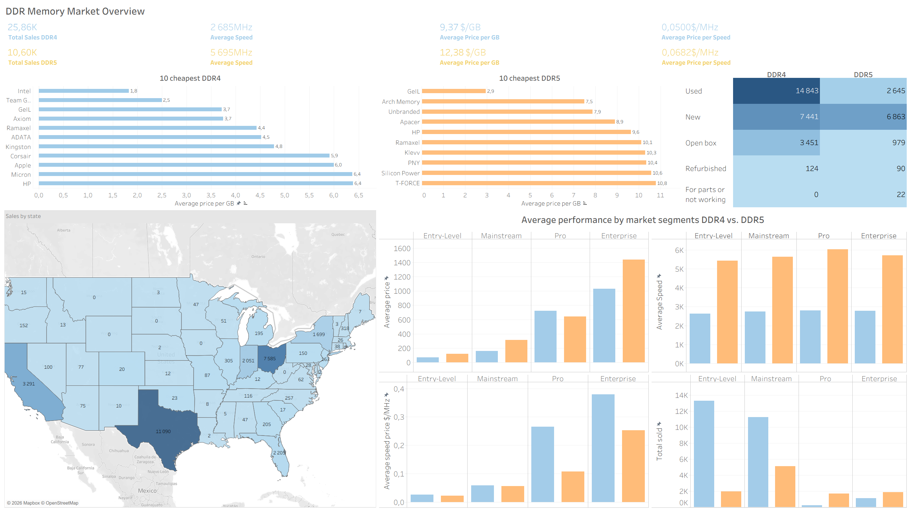

# E-Commerce RAM Pricing Intelligence 2026

Analysis of the DDR memory market based on eBay listings data.

## What's inside

| Folder | Contents |
|---|---|
| `data/raw/` | Original dataset (~2,900 listings) |
| `data/processed/` | Normalized tables: products, listings, MPN |
| `notebooks/` | Data cleaning & normalization (Python / Pandas) |
| `sql/` | 12 analytical queries (SQLite) |

## Key findings

- DDR5 costs ~33% more per GB than DDR4 ($12.38 vs $9.37)
- Used condition dominates DDR4 demand; DDR5 is sold mostly New
- Texas leads U.S. sales by a wide margin (11,090 units)
- Intel and Team Group offer the cheapest DDR4; GeIL leads budget DDR5

## Tools

Python · Pandas · SQL · Tableau Public

**Tableau dashboard:** https://public.tableau.com/app/profile/zoia.lunova/viz/DASHBOARD_RAW/Dashboard1

## Data source

[E-Commerce RAM Pricing Intelligence 2026](https://www.kaggle.com/datasets/kanchana1990/e-commerce-ram-pricing-intelligence-2026) by Kanchana Karunarathna · [CC BY 4.0](https://creativecommons.org/licenses/by/4.0/)
